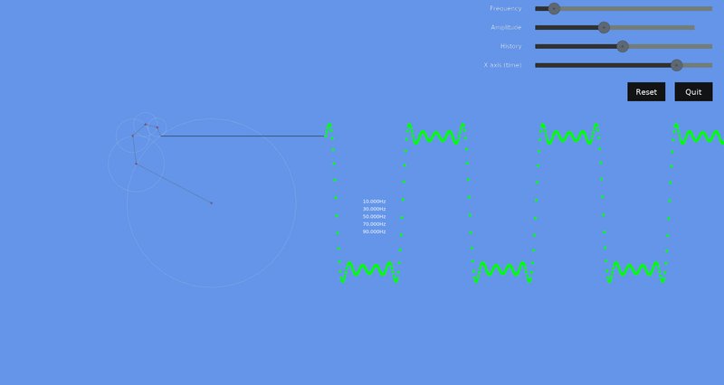
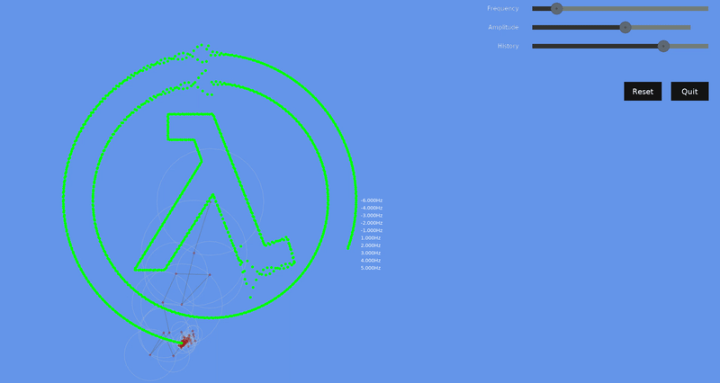

# Draw FFT

Yet another application which draws an image (vector svg or raster png, jpg) or
an audio signal (wav) using the fast fourier transform (FFT) simulating inversed
fourier transform as a graphical representation of the vector rotation.

This is inspired by this wonderful work https://lubosmato.github.io/drawfft/.

## How to use?

#### $ ./draw-fft.py data/square.wav --freq-count 100

#### $ ./draw-fft.py data/lambda.svg

#### $ ./draw-fft.py ./data/finn-jake.png --samples-count=4000

